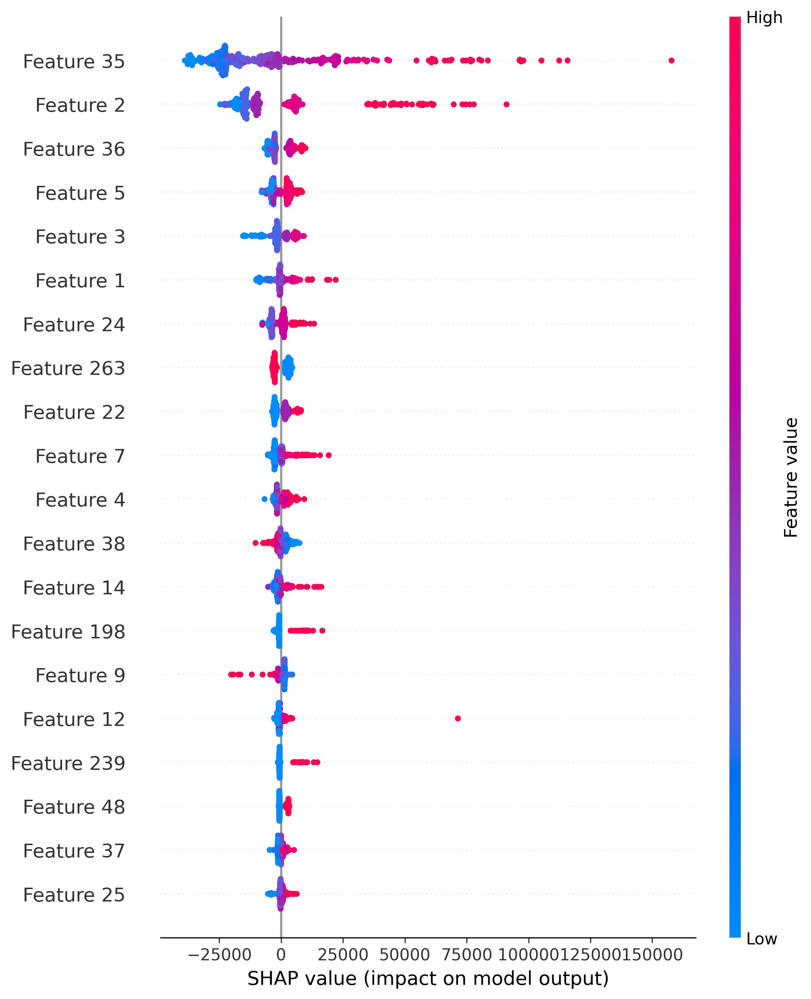

# Week 3: Feature Engineering and Ensemble Learning

## Project Objective

The objective of this project is to improve house price prediction performance using feature engineering, preprocessing pipelines, ensemble learning algorithms, and hyperparameter tuning.

## Dataset

The project uses the Kaggle House Prices dataset.

## Workflow

1. Data loading and exploration
2. Feature engineering
3. Handling numerical and categorical features
4. Feature scaling
5. One-hot encoding
6. Preprocessing pipeline
7. Ensemble model training
8. Model comparison
9. Cross-validation
10. Hyperparameter tuning using GridSearchCV
11. Feature importance analysis
12. SHAP-based model interpretation
13. Final model evaluation

## Ensemble Models

The following models were compared:

- Random Forest
- Gradient Boosting
- XGBoost
- LightGBM

## Model Comparison

| Model | R² Score | RMSE | MAE |
|---|---:|---:|---:|
| Random Forest | 0.8846 | 29751.28 | 17586.05 |
| Gradient Boosting | 0.9109 | 26138.30 | 15754.80 |
| XGBoost | 0.9150 | 25528.05 | 15773.23 |
| LightGBM | 0.8836 | 29884.81 | 17148.42 |

## Hyperparameter Tuning

GridSearchCV with 5-fold cross-validation was used to optimize the XGBoost model.

Best parameters:

- Learning rate: 0.05
- Max depth: 3
- Number of estimators: 300
- Subsample: 0.8

## Final Tuned XGBoost Results

- R² Score: 0.9228
- RMSE: 24340.64
- MAE: 15236.77

The tuned XGBoost model achieved the best performance among the evaluated models.

## Explainability

Feature importance analysis and SHAP were used to understand which features contributed most to the model's predictions.
## SHAP Feature Importance

SHAP was used to explain the XGBoost model and identify how individual features contribute to the model's predictions.

## Final Model

The final tuned XGBoost pipeline was saved as:

`tuned_xgboost_model.pkl`

## Conclusion

Feature engineering, preprocessing pipelines, ensemble learning, cross-validation, and hyperparameter tuning significantly improved the house price prediction model. The tuned XGBoost model achieved an R² score of approximately 0.923, making it the final selected model for this project.
